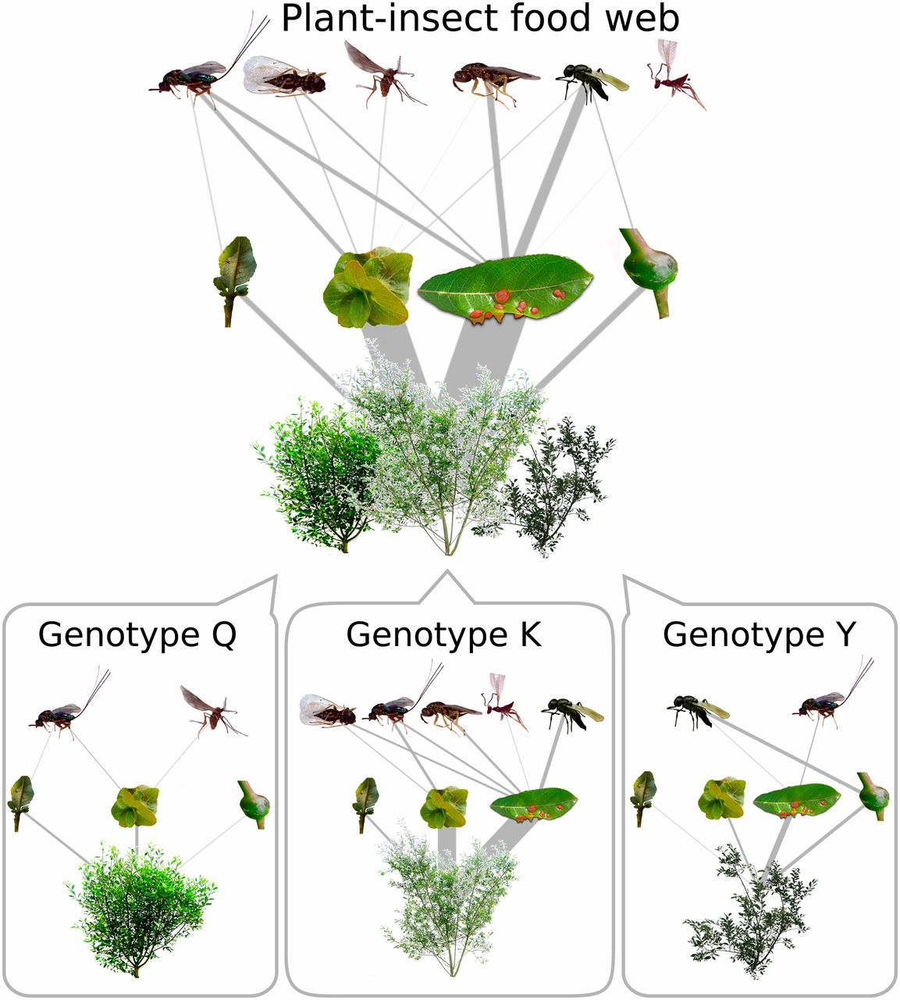

```{r setup, include=FALSE}
knitr::opts_chunk$set(echo = FALSE)
library(cowplot)
```

\newpage

```{r tables-mtcars, echo=FALSE}
knitr::kable(iris[1:5, ], caption = '\\label{tab:Tab1}A caption.')
```

\newpage

```{r ChunkName, echo=FALSE, fig.pos="h", out.width='50%', fig.align='center', fig.cap="\\label{fig:Fig1}Here is a nice figure from one of my papers. You can use chunk options for resizing and aligning the figure."}
# this code works the same with a .png or .pdf file
# for a .pdf file though, you won't be able to adjust the size here,
# so you'll have to make sure it fits just right when you make the pdf
 
```

\newpage

```{r Rplot, echo=FALSE, fig.height = 5, fig.width = 6, fig.cap="\\label{fig:Fig2}Here is a figure generated directly from R code. Note that you use different chunk options to adjust this type of figure."}
# fig.height and fig.width are in inches
ggplot(cars, aes(speed, dist)) + geom_point()
```

