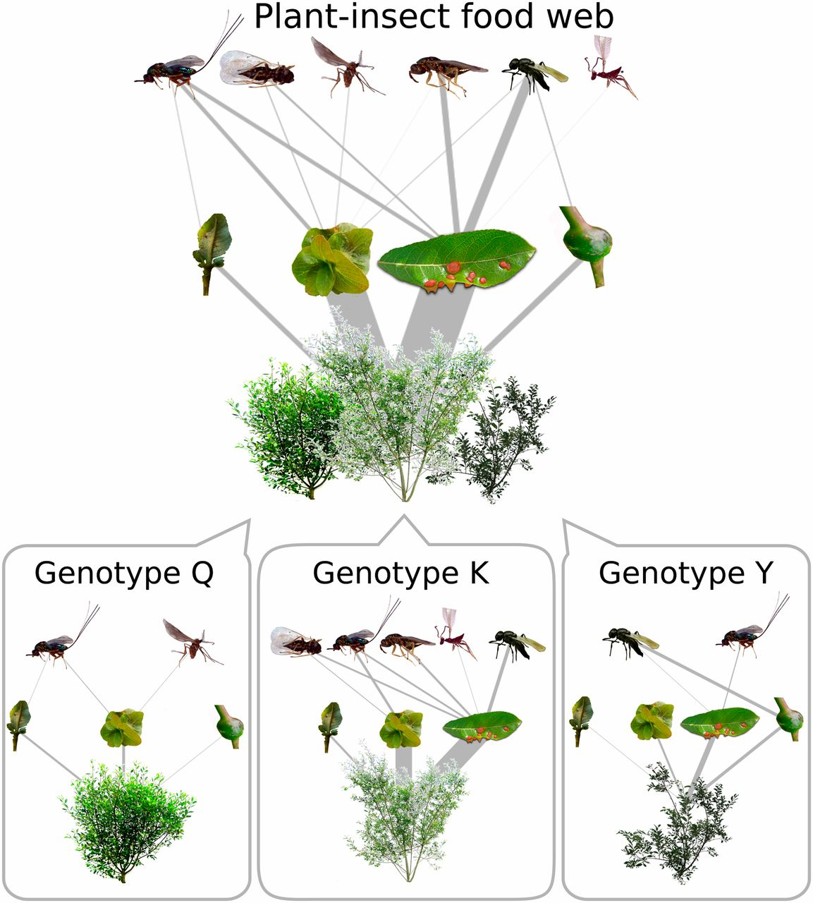

---
# I choose to manually format the title page because it gives me greater control. Note that you should put this info in the YAML header for compatability across document formats (e.g. html)
#title: "Manuscript Template"
#subtitle: "Subtitles aren't common in manuscripts..."
#author: 
#- Matthew A. Barbour$^{1,2,\ast}$ 
# for compatability across document formats use 'date' for affiliations, as recommended by https://github.com/rstudio/bookdown/issues/348, with | to create new sections.
#date: | 
#    | 1. Affiliation

# If you want to include the date for some reason, you could do the following, or write it in manually
# date: '`r format(Sys.Date(), "%m %d, %Y")`' # Beware that single quotes ' ' are necessary for programming the date generation (https://stackoverflow.com/questions/23449319/yaml-current-date-in-rmarkdown)
output: 
    word_document: default
    # see this article (https://rmarkdown.rstudio.com/articles_docx.html) for more details on how to specify your own style file for docx files
    # note that using LaTeX within the R Markdown won't translate well to a word_document. May be best to choose one or the other for your workflow.
    pdf_document:
      keep_tex: false
      toc: false
      number_sections: false
      fig_caption: true
      citation_package: natbib
      #includes:
        # this is necessary if the journal requires you to place
        # figures and table at the manuscript. Right now, there
        # doesn't appear to be an easier way to do this.
        # (https://community.rstudio.com/t/change-location-of-bibliography-in-bookdown-latex/16928)
        #after_body: Figures_AfterBody_Edited.tex
fontsize: 11pt
fontfamily: mathpazo
linkcolor: black
urlcolor: blue # black
citecolor: black
documentclass: article
bibliography: References.bib 
biblio-style: EcolLett.bst # filename has to be all one word for some reason (last time I tried at least).
# here are some useful links to some resources for .bst files
# for journals in ecology and evolutionary biology
# https://github.com/seananderson/bst
# http://users.fred.net/tds/lab/latex.html
header-includes:
  # inspired by The American Naturalist's LaTeX Template
  - \usepackage{fullpage}
  - \linespread{1.5} 
  - \usepackage{lineno}
  - \usepackage{caption,setspace} # adding ,setspace returns to 1 linespread in figure caption. You can remove or adjust in \captionsetup
  - \captionsetup[figure]{font=small}
#geometry: margin=1in # you can get more detailed here, e.g. left=2cm,right=2cm,top=2cm,bottom=2cm # geometry is not necessary for manuscripts, but could be useful for other PDF docs
---

```{r setup, include=FALSE}
# for manuscripts, you generally want 'echo = FALSE'
# because you don't want to display code chunks.
# If this is set to TRUE, then you will have to specifically
# add 'echo=FALSE' in each code chunk.
knitr::opts_chunk$set(echo = FALSE, warning = FALSE, message = FALSE) 

# load required libraries, e.g.
library(cowplot) # built off ggplot2, but with publication quality defaults
```

<!-- This is how you hide notes/comments in R Markdown text -->

<!-- Begin title page formatting -->

\vspace*{0.1cm} 
\begin{center} \LARGE Manuscript Template \end{center}

\bigskip

\begin{center} \large Matthew A. Barbour$^{1,2,\ast}$ \normalsize \end{center}

\bigskip

\noindent 1. University of Zurich, Department of Evolutionary Biology and Environmental Studies, Zurich, 8057 ZH, Switzerland;

$^\ast$ Corresponding author; e-mail: matthew.barbour@ieu.uzh.ch

\bigskip

*Short Running Title*: MS Template

\bigskip

*Keywords*: food webs; eco-evolutionary dynamics.

\bigskip

*Total Word Count*: `r wordcountaddin::word_count("MABarbour_Style.Rmd")`

\bigskip

*Another Title Page Requirement*: You could include a statement of authorship for the manuscript for example.

<!-- End title page formatting -->

\linenumbers{}
\modulolinenumbers[3]

\newpage

# Abstract

You'll see that I use a combination of LaTeX and R Markdown here. I try to use R Markdown whenever possible because it is cleaner and will knit more consistently across different formats (e.g., html or docx). LaTeX can give finer control though, and is necessary to use if you're trying to format something within a LaTeX command.

\newpage

# Introduction

It's easy to cite multiple articles and include other text within the citation [e.g., @barbour2012diel; @barbour2012ground]. It also takes care of papers with many authors easily according to the appropriate style file [@barbour2016genetic].

\ <!-- this acts like \bigskip in Latex. Don't forget to put the space after it though! -->

# Material and methods

## Common formatting for R Markdown (like this Subsection)

Check out this [Cheat Sheet for R Markdown](https://rstudio.com/wp-content/uploads/2015/02/rmarkdown-cheatsheet.pdf)^[You can set 'linkcolor: black' in the YAML header for an actual manuscript. I've used a blue color here to make it clear that it's a hyperlink. Also, you'll probably never need a footnote for a manuscript, but this is how you would do it in R Markdown.] for how to deal with many common formatting issues, but I've also include some formatting details that are common for manuscripts below:

*Italics*; **Bold**; Sub~script~; Super^script^

<!-- You can also make further subsections, but if you're doing this in a manuscript you should probably rethink you're writing...
### Subsubsection

#### Subsubsubsection
-->

## Equations

You'll have to write equations with Latex code. Below is an example of a continuous-time model of two consumers competing for two resources.

\begin{equation} \label{eq:1}
  \begin{split}
     & \frac{dR_1}{dt}=r_1R_1(1-\frac{R_1}{K_1})-F_{11}(R_1)C_1-F_{12}(R_1)C_2 \\
     & \frac{dR_2}{dt}=r_2R_2(1-\frac{R_2}{K_2})-F_{21}(R_2)C_1-F_{22}(R_2)C_2 \\
     & \frac{dC_1}{dt}=e_{11}F_{11}(R_1)C_1+e_{21}F_{21}(R_2)C_1-m_1C_1 \\
     & \frac{dC_2}{dt}=e_{12}F_{12}(R_1)C_2+e_{22}F_{22}(R_2)C_2-m_2C_2 \\
  \end{split}
\end{equation}

\ 

# Results

```{r ExampleAnalysis, include=FALSE, cache=TRUE}
iris.lm <- lm(Petal.Length ~ Species, iris)
```

It is easy to reproduce summary statistics and analyses, rather than having to copy and paste them from a spreadsheet. For example, the mean $\pm$ SD of *Iris* petal length corresponds to: `r round(mean(iris$Petal.Length),2)` $\pm$ `r round(sd(iris$Petal.Length),2)`. Similarly, we include more specific statistical analyses. For example, I found that species identity had a strong effect on *Iris* petal length 
(*F*~`r anova(iris.lm)["Species","Df"]`,`r anova(iris.lm)["Residuals","Df"]`~ = 
`r round(anova(iris.lm)["Species","F value"],1)`,
*P* `r ifelse(anova(iris.lm)["Species","Pr(>F)"] < 0.001, "< 0.001", paste("= ",round(anova(iris.lm)["Species","Pr(>F)"],3)))`).

Although you can't see it, I have "cached" the results from the above analysis. This isn't necessary for such a small analysis, but if you have larger simulations or analyses setting "cache=TRUE" in the chunk option will save you a lot of time.

It is also easy to include figures and link the figures to the main text. For example, click on the number 3 to go to a figure I made for one of the papers from my PhD (Fig. \ref{fig:Fig1}). This figure was a simple image file (.jpg), but I can also make figures with R code inside this document (e.g., Fig. \ref{fig:Fig1})

\ 

```{r ChunkName, fig.pos="h", out.width='50%', fig.align='center', fig.cap="\\label{fig:Fig1}Here is a figure from one of my papers. You can use chunk options for resizing and aligning the figure. Apparently, *R Markdown* formatting doesn't work (at least for me right now) inside figure legends, so you'll have to use \\textit{LaTeX}. Remember though that you'll have to precede any LaTeX command with an extra backslash."}
# this code works the same with a .png or .pdf file
# for a .pdf file though, you won't be able to adjust the size here,
# so you'll have to make sure it fits just right when you make the pdf
 
```

```{r Rplot, fig.height = 5, fig.width = 6, fig.cap="\\label{fig:Fig2}Here is a figure generated directly from R code. I like to use the R package \\emph{cowplot} for figures, because the default looks nice and ready for a publication. Note that you have to use different chunk options to adjust this type of figure. This figure will be automatically saved as a pdf file that is used for this manuscript."}
# fig.height and fig.width are in inches
ggplot(cars, aes(speed, dist)) + geom_point() + geom_smooth() +
  xlab("Speed") + ylab("Distance")
```

```{r OldChunk, include=FALSE, eval=FALSE}
# 'include=FALSE', will not include this code chunk in the output
# but it will evaluate it.
# If you don't want to evaluate it, set 'eval=FALSE'
ggplot(iris, aes(x = Species, y = Petal.Length)) +
  geom_boxplot()
# This could be useful if you're still deciding whether or not to include a figure or table in a manuscript.
```

You can do the same for tables, like this table of *Iris* floral characters (Table \ref{tab:Tab1}).

```{r tables-mtcars}
knitr::kable(iris[1:5, ], caption = '\\label{tab:Tab1}A caption.')
```

\ 

# Discussion

This is by no means a definitive guide to writing reproducible manuscripts in R Markdown. 

I have tried to cover simple solutions to common problems I have encountered, especially when knitting to a pdf_document. This simple style, which was inspired by *The American Naturalist*'s [LaTeX template](https://www.journals.uchicago.edu/pb-assets/docs/journals/AmNat_MS_template-1515709536857.tex), and should be compatible for an initial submission to any journal in ecology or evolutionary biology (with minimal tweaks).

Below, I've included some links to resources that may help you address issues more detailed issues that I have not covered here.

- Book on ["R Markdown: The Definitive Guide"](https://bookdown.org/yihui/rmarkdown/)

- Slide presentation on ["Writing reports and manuscripts in R Markdown"](http://rstudio-pubs-static.s3.amazonaws.com/368020_865af4d4afaa4c5cbdb95a7b2670c812.html#1)

- Blogpost on ["Tips and tricks for working with images and figures in R Markdown documents"](http://zevross.com/blog/2017/06/19/tips-and-tricks-for-working-with-images-and-figures-in-r-markdown-documents/)

# Acknowledgements

A lot of different resources have been useful to me over the past year in learning how to write reproducible manuscripts in R that I'm probably forgetting. I apologize for not including them here. 

# References